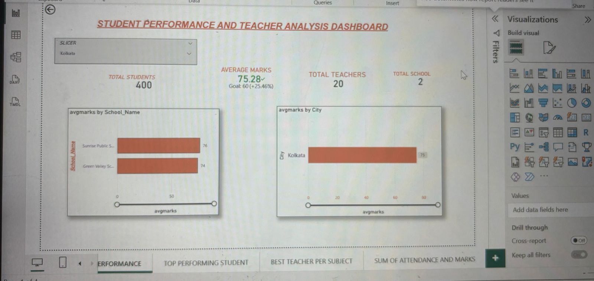

# Student-performance-dashboard
Student Performance &amp; Teacher Analysis Dashboard using Power BI
## 🎯 Problem Statement
The goal of this project is to analyze student performance data and evaluate teacher effectiveness using data-driven insights.

---

## 📁 Dataset
The dataset contains information about:
- Student marks
- Attendance
- Subjects
- Teachers

---

## 🔍 Key Work
- Cleaned and processed raw student data  
- Analyzed marks, attendance, and subject-wise performance  
- Evaluated teacher effectiveness based on student outcomes  
- Built an interactive dashboard using Power BI  

---

## 📊 Dashboard Features
- Filters: Student, Teacher, Subject  
- KPIs: Average Marks, Attendance %, Top Performers  
- Visuals: Performance comparison charts  

---

## 💡 Key Insights
- Students with higher attendance performed better  
- Identified top-performing and low-performing subjects  
- Found variation in performance across different teachers  
- Highlighted students needing improvement  

---

## 🛠️ Tools Used
- Power BI  
- Excel  

---

## 📷 Dashboard Preview

---

## 📈 Outcome
This project helped in understanding how data can be used to improve student performance and support decision-making in education.

---

## 🚀 Future Improvements
- Add more datasets for deeper analysis  
- Include predictive analysis  
- Improve dashboard interactivity  

---

## 📁 Project Files
- shree (.pbix)  
- Dataset (.xlsx/.csv)  
- Dashboard Screenshot  

---

## 🙋‍♀️ About Me
I am an aspiring Data Analyst skilled in Python, SQL, Excel, and Power BI, actively looking for entry-level opportunities.
